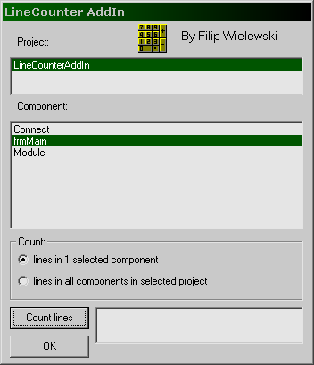



## LineCounter AddIn

### Description

This program counts lines in your projects. It is run from "Add-Ins" menu in VB. It is an easy example of using VB IDE and everyone who wants to write VB AddIns may begin viewing this code.
 
### More Info
 

             |
---                |---
**Submitted On**   |2003-08-07 21:04:36
**By**             |[Filip Wielewski](https://github.com/Planet-Source-Code/PSCIndex/blob/master/ByAuthor/filip-wielewski.md)
**Level**          |Beginner
**User Rating**    |5.0 (10 globes from 2 users)
**Compatibility**  |VB 6\.0
**Category**       |[VB function enhancement](https://github.com/Planet-Source-Code/PSCIndex/blob/master/ByCategory/vb-function-enhancement__1-25.md)
**World**          |[Visual Basic](https://github.com/Planet-Source-Code/PSCIndex/blob/master/ByWorld/visual-basic.md)
**Archive File**   |[LineCounte1634598242003\.zip](https://github.com/Planet-Source-Code/filip-wielewski-linecounter-addin__1-47949/archive/master.zip)

